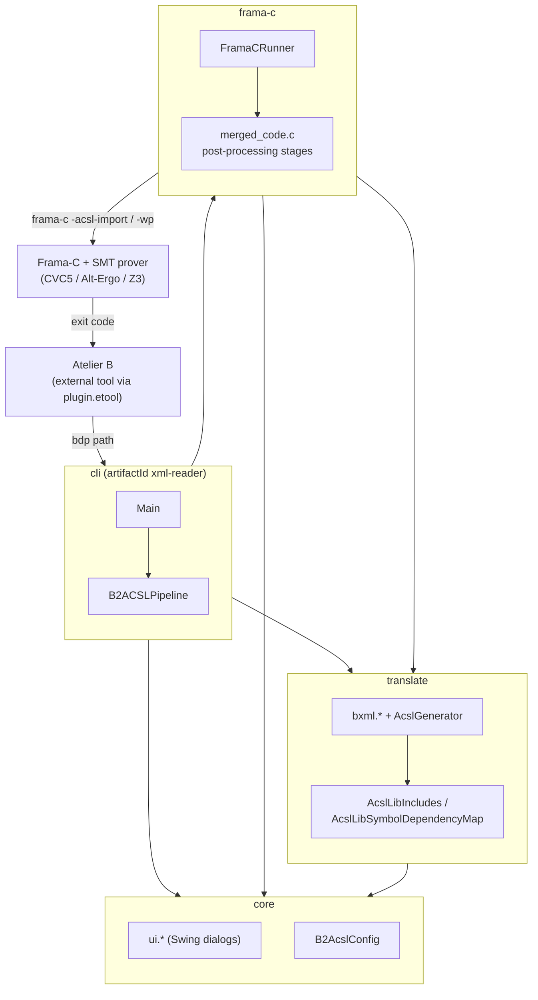

# xml-reader (Java 21 + Maven)

*[🇧🇷 Versão em português](README.pt-BR.md)*

Maven-structured sample project for:

- Reading XML with **Jackson Dataformat XML**
- Building an **Uber-JAR** (Shade) for use with `jpackage`
- Building a native executable with **GraalVM Native Image**
- Building an installer with **jpackage** (Linux/macOS/Windows)

## Architecture

The project is a multi-module Maven reactor with 4 modules and an acyclic dependency graph
between them: `core` and `translate` depend on nothing else in the project; `frama-c` depends on
both; `cli` depends on all three.



`translate` is the truly standalone module (zero dependencies on any other module in the
project) — it carries the BXML → ACSL translation and the `B2ACSLLib` library (Git submodule),
and can be consumed on its own by another JVM tool without pulling in Swing/AWT or the Frama-C
invocation.

## Cloning the repository

The plugin depends on the ACSL library at `translate/src/main/resources/lib`, tracked as a Git submodule pointing to [ACSL2BMethodLib](https://github.com/fagnerdias/ACSL2BMethodLib).

Clone the main repository together with the submodule:

```bash
git clone --recurse-submodules git@github.com:fagnerdias/B2ACSLPlugin.git
cd B2ACSLPlugin
```

If the repository was already cloned without `--recurse-submodules`, initialize the submodule afterwards:

```bash
git submodule update --init --recursive
```

## Updating the project

To update the main repository and the submodule's pinned commit:

```bash
git pull
git submodule update --init --recursive
```

To fetch the latest version of the library from the submodule's own remote:

```bash
git submodule update --remote translate/src/main/resources/lib
```

Review the changes in `translate/src/main/resources/lib` before pinning a new submodule commit in the main repository.

### ACSL library on the classpath

The submodule fills `translate/src/main/resources/lib` with the full ACSL2BMethodLib repository. The plugin loads ACSL functions directly from `translate/src/main/resources/lib/B2ACSLLib` on the classpath (Maven module `translate`).

The dependency map between library symbols lives at `translate/src/main/resources/b2acsl/symbol_dependency_map.json` and can be regenerated with:

```bash
python3 scripts/generate_acsl_symbol_dependency_map.py
```

## Prerequisites

- **JDK 21+** (bundles `jpackage`)
- **Maven 3.9+**
- (Optional) **GraalVM 21+** with `native-image` installed, for `make build-native`

On Ubuntu/Debian, to install Maven:

```bash
sudo apt update && sudo apt install -y maven
```

### GraalVM Native Image (optional)

If you plan to build the native executable:

- Install a GraalVM distribution compatible with Java 21
- Point `JAVA_HOME` to the GraalVM installation
- Make sure `native-image` is installed

## Project layout

The project is a multi-module Maven reactor (root `pom.xml`, `packaging=pom`), split into 4 modules with an acyclic dependency graph (`core`/`translate` depend on nothing else in the project; `frama-c` depends on both; `cli` depends on all three):

- `core/`: Swing dialogs (`com.example.ui.*`), the `-ulevel` estimator (`com.example.analysis`), typed configuration (`B2AcslConfig`)
- `translate/`: BXML → ACSL translation (`com.example.bxml.*`, `AcslGenerator`), library resolution (`AcslLibIncludes`, `AcslLibSymbolDependencyMap`); includes the Git submodule `translate/src/main/resources/lib/` (`B2ACSLLib/`), `translate/src/main/resources/b2acsl/symbol_dependency_map.json`, and the JUnit tests (`translate/src/test/`)
- `frama-c/`: Frama-C invocation (`FramaCRunner`) and `merged_code.c` post-processing
- `cli/`: entry point (`Main.java`) and orchestration (`B2ACSLPipeline`) — artifactId kept as `xml-reader` (not `b2acsl-cli`), and its build output redirected to the root `target/`, to preserve the paths `scripts/run_examples.sh`, the `Makefile`, and Atelier B's `plugin.etool` already expected before the module split
- `pom.xml`: reactor parent — shared properties, `<modules>`, plugin versions
- `Makefile`: `build-jar`, `build-native`, `build-installer`, `clean` automation (uses `mvn -pl cli help:evaluate` to look up the final module's `artifactId`/`version`)

## How to run it

### 1) Build and run the Uber-JAR

```bash
make build-jar
java -jar target/xml-reader-0.1.0-all.jar
```

> Note: the JAR name follows the `target/<artifactId>-<version>-all.jar` pattern.

### 2) Build a native executable (GraalVM)

```bash
make build-native
```

Common outputs:

- Linux/macOS: `target/xml-reader`
- Windows: `target/xml-reader.exe`

### 3) Build an installer with jpackage

```bash
make build-installer
```

The `Makefile` picks the installer type based on the OS:

- Linux: `.deb` (requires system tools such as `dpkg-deb`)
- macOS: `.dmg`
- Windows: `.exe` (may require an additional toolchain depending on the chosen type)

Output files land in `target/installer/`.

## Notes on compatibility (jpackage + modules)

The `build-installer` target uses `--add-modules java.base,java.xml,java.logging` to make sure the essential modules are available in the packaged runtime.

If you add libraries/resources that depend on other modules (e.g. `java.sql`, `java.desktop`), add them to `--add-modules` in the `Makefile` as well.

## Useful commands

```bash
make clean
```

## File ETool

```
<externalTool name="B2ACSL"
    category="project"
    label="Verify C code"
    tooltip="Uses the models specified to generate specification to verify the C code generated">

    <command>java</command>
    <param>-Db2acsl.mock=false</param>
    <param>-jar</param>
    <param> <path to .jar file> </param>
    <param>${projectBdp}</param>

</externalTool>
```